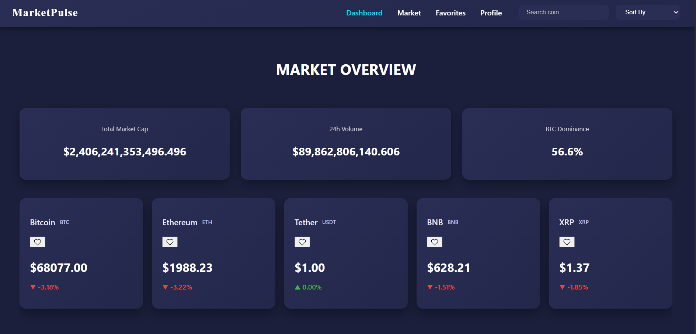
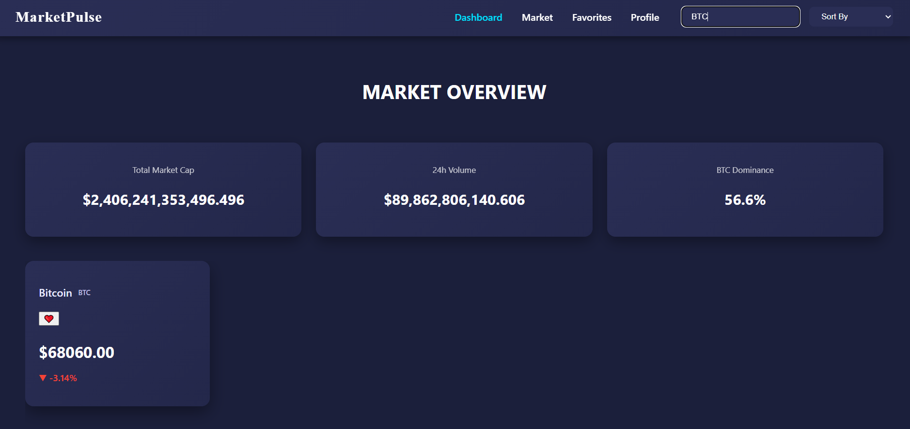
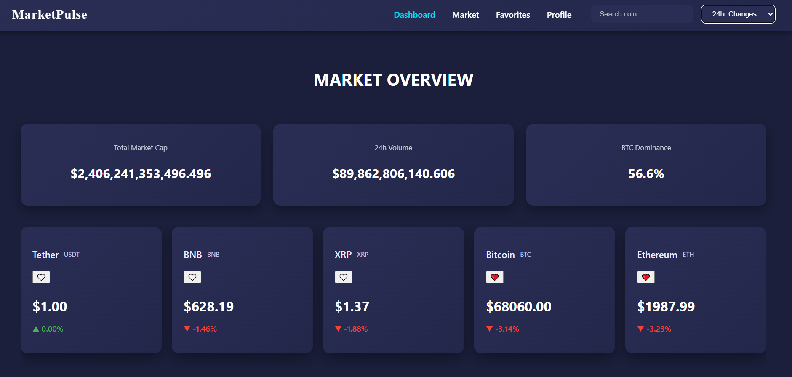
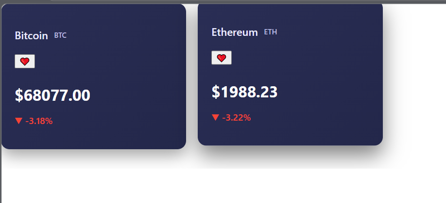

# 📊 MarketPulse — Real-Time Cryptocurrency Dashboard

MarketPulse is a **real-time cryptocurrency dashboard** built with React that allows users to track live market prices, monitor market trends, and manage favorite coins using an intuitive and responsive interface.  

The goal of this project is to demonstrate **API integration, state management, and responsive UI design** using React.

---

# 🚀 Live Demo

🔗 Live Application  
https://market-pulse-blond.vercel.app/

🔗 GitHub Repository  
https://github.com/kaurashi/market-pulse.git
---

# ✨ Features

✔️ Real-time cryptocurrency market data  
✔️ Search cryptocurrencies by name or symbol  
✔️ Sort coins by price, market cap, and 24h change  
✔️ Favorite coins for quick access  
✔️ Persistent favorites using localStorage  
✔️ Responsive dashboard UI  
✔️ Horizontal scrolling card layout  
✔️ Smooth page navigation with React Router  

---

# 🛠️ Tech Stack

### Frontend
- React.js  
- JavaScript  
- CSS 

### API
- CoinGecko API  

### Deployment
- Vercel  

### Version Control
- Git & GitHub  

---

# 📂 Project Structure

```
market-pulse-new/
│
├── src/
│   ├── components/
│   │   ├── Card.css
│   │   ├── Card.js
│   │   ├── MarketSummary.css
│   │   ├── MarketSummary.js
│   │   ├── Navbar.css
│   │   └── Navbar.js
│   │
│   ├── pages/
│   │   ├── Dashboard.css
│   │   ├── Dashboard.js
│   │   ├── Favorites.js
│   │   ├── Market.js
│   │   ├── Profile.css
│   │   └── Profile.js
│   │
│   ├── App.css
│   ├── App.js
│   ├── App.test.js
│   ├── index.css
│   └── index.js

```

---

# ⚙️ Installation

Clone the repository

```bash
git clone https://github.com/kaurashi/market-pulse.git
```

Navigate to the project folder

```bash
cd market-pulse-new
```

Install dependencies

```bash
npm install
```

Run the development server

```bash
npm start
```

---

# 📸 Screenshots

### 🏠 Dashboard
Shows the main cryptocurrency cards with real-time price data.

```markdown

```

---

### 🔎 Search Feature
Allows users to search for specific cryptocurrencies.

```markdown

```

---

### 📊 Sorting
Users can sort coins by price, market cap, or percentage change.

```markdown

```

---

### ⭐ Favorites
Users can mark coins as favorites and access them quickly.

```markdown

```

---

# 🎯 Learning Outcomes

Through this project I learned:

- Integrating external APIs in React applications  
- Managing application state effectively  
- Building reusable UI components  
- Implementing persistent user data using localStorage  
- Designing responsive dashboards  
- Deploying applications using Vercel  

---

# 🔮 Future Improvements

- Add detailed cryptocurrency analytics page  
- Implement price trend charts  
- Add dark/light mode toggle  
- Improve filtering and sorting options  
- Add pagination for large datasets  

---

# 👨‍💻 Author

**Ashmeet Kaur**

GitHub  
https://github.com/kaurashi

---

# ⭐ Support

If you like this project, please give the repository a **star**!